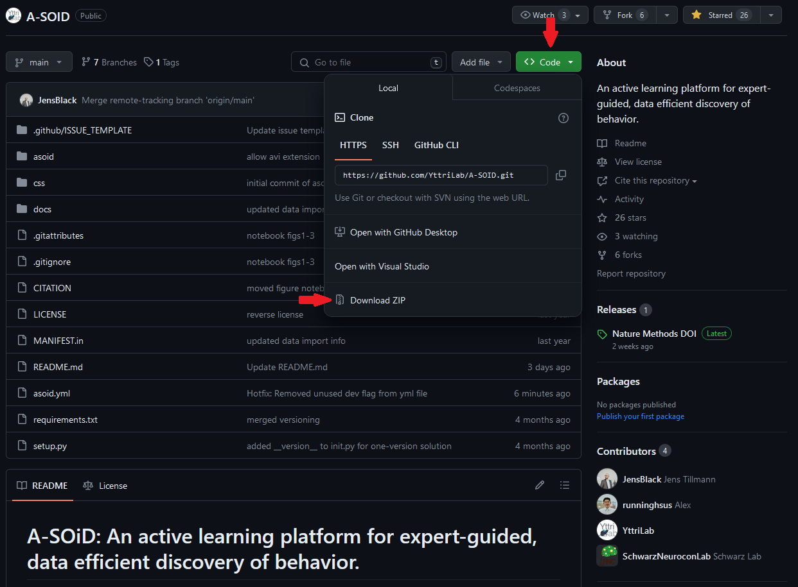
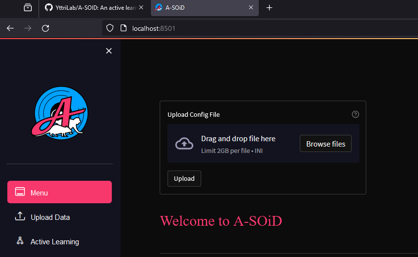

Here's a step-by-step guide to install A-SOiD:

### Step 0: Required for some Mac Users (e.g., M1 Max and M2 MacBooks)

Install Xcode Command Line Tools by running the following command in a terminal:

```bash
xcode-select --install
```
Continue with the steps below.

### Step 1: Install Anaconda or Miniconda
First, ensure you have Anaconda or Miniconda installed on your system.

- **Anaconda**: Download and install from [Anaconda's website](https://www.anaconda.com/products/individual).
- **Miniconda**: Download and install from [Miniconda's website](https://docs.conda.io/en/latest/miniconda.html).

> **Note**: If you already have Anaconda or Miniconda installed, you can skip this step.

The following steps assume you have Anaconda or Miniconda installed and are using a terminal or command prompt.

> How to start a terminal or command prompt: [Link to Anaconda documentation](https://docs.conda.io/projects/conda/en/stable/user-guide/getting-started.html)

### Step 2: Download the GitHub Repository
> Step 2a and 2b are two different ways to download the repository. Choose one of the two options.

#### Step 2a: Download the GitHub Repository
Either download the GitHub repository to your local machine by clicking the green "Code" button and selecting "Download ZIP" in the "Local" tab.



Then, unzip the downloaded file in your desired location.

#### Step 2b: Clone the GitHub Repository
OR use Git to clone the repository to your local machine.

```bash
git clone https://github.com/YttriLab/A-SOID.git
cd repository
```

### Step 3: Navigate to the Repository Directory
After cloning or unzipping, navigate to the repository directory by using the `cd` command.
For example, if the repository is located in `path/to/repository`, use the following command:

```bash
cd path/to/repository
```
> **Note**: Replace `path/to/repository` with the actual path to the repository.

### Step 4: Create a Conda Environment Using the `.yml` File
Use Conda to create an environment from the `.yml` file. 

This will install the package and its dependencies into a new environment called `asoid`.

```bash
conda env create -f asoid.yml
```
> **Note**: This may take a few minutes to complete.

> Some users (windows) might experience this [issue](https://github.com/YttriLab/A-SOID/issues/59) with building hdbscan if they have not installed C++ build tools on their machine previously. The solution is to install Microsoft C++ build tools (see link) and restart this step. This might include removing the environment and recreating it ([How to remove a conda environment](https://stackoverflow.com/questions/49127834/removing-conda-environment))

### Step 5: Activate the New Environment
Once the environment is created, activate it.

```bash
conda activate asoid
```
> **Note**: You will need to activate the environment in each terminal in which you want to use it.

### Step 7: Start A-SOiD
Start A-SOiD by running the following command:

```bash
asoid app
```

> **Note**: This will open a new tab in your default browser. If it does not, copy the URL from the terminal and paste it into your browser.

#### Expected Output

```bash
(asoid) C:\Users\JSchw\PycharmProjects\A-SOID>conda activate asoid

(asoid) C:\Users\JSchw\PycharmProjects\A-SOID>asoid app

  You can now view your Streamlit app in your browser.

  Local URL: http://localhost:8501
  Network URL: http://172.26.33.62:8501

```

Your browser should open to the following page (or something similar):


> **Note**: The first time you run A-SOiD, it may take a few seconds to load.

### Additional Tips
- **Updating the Environment**: If the `.yml` file is updated, you can update your environment using `conda env update -f environment.yml`.
- **Troubleshooting**: If you encounter issues, check the repository's `README` or GitHub issues for specific instructions or troubleshooting tips.
